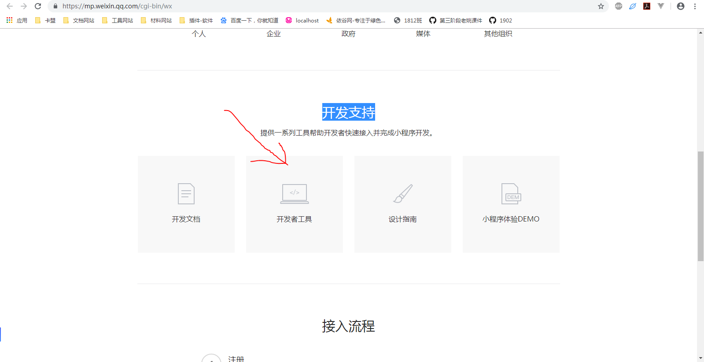
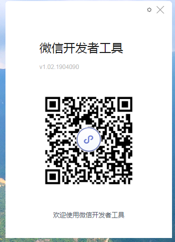
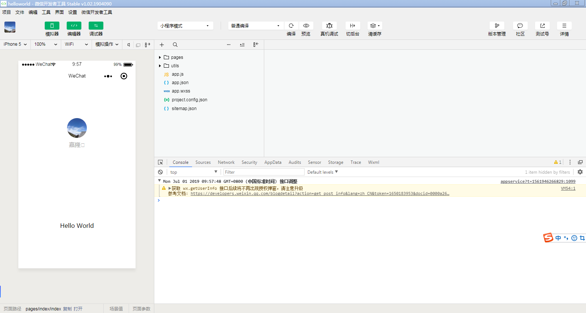

# 微信小程序

运行在微信平台上面的一个小型网页应用

在浏览器里面浏览网页很像，必须在微信打开，并且可以微信上的一些功能(底层API，开摄像头，定位，拍照，微信支付，分享朋友圈)

- 字节跳动小程序
- 支付宝小程序
- 百度小程序
- Facebook小程序
- QQ小程序

# HTML CSS JS

他们运行在浏览器上面，而浏览器客户端，你可以在任何系统上打开同一个网页，用不同的系统的浏览器，单独为每个系统开发一个应用，成本会非常高

|||
|-|-|
|Android|Java|
|IOS|ObjectC/swift|
|混合开发|浏览器客户端+前端语言(html+css+js)|
|小程序|微信打包了一个浏览器|

# 官方

- [微信小程序官网](https://mp.weixin.qq.com/cgi-bin/wx)

# 开发者工具

先下载[微信开发者工具](https://developers.weixin.qq.com/miniprogram/dev/devtools/download.html)



微信开发者工具是用Node写的（electron，nw），开发小程序技术React

安装成功后，运行微信开发者工具，会出现以下界面



开发界面如下图



# 代码构成

小程序只有三类JSON文件

- app.json 应用的全局配置文件
- project.config.json 开发工具的配置文件
- pages/logs 目录下还有一个 logs.json 页面局部配置文件 会覆盖app.json的window选项

## 小程序配置 app.json

app.json 是当前小程序的全局配置，包括了小程序的所有页面路径、界面表现、网络超时时间、底部 tab 等。QuickStart 项目里边的 app.json 配置内容如下：

```json
{
  "pages": [
    "pages/index/index",
    "pages/logs/logs"
  ],
  "window": {
    "backgroundTextStyle": "light",
    "navigationBarBackgroundColor": "#58bc58",
    "navigationBarTitleText": "QQ音乐",
    "navigationBarTextStyle": "white"
  },
  "sitemapLocation": "sitemap.json"
}
```

你只需要改动一些参数，就可以更改微信小程序的页面表现，比如可以改头部，底部，路由，网络请求处理

- pages字段 —— 用于描述当前小程序所有页面路径，这是为了让微信客户端知道当前你的小程序页面定义在哪个目录。它本质就是路由。
- window字段 —— 定义小程序所有页面的顶部背景颜色，文字颜色定义等。
- tabBar字段 —— 底部导航栏

[详情请看app.json配置文档](https://developers.weixin.qq.com/miniprogram/dev/framework/config.html)

# WXML 模板

WXML其实类似HTML，它其实是对原生标签的封装，结合微信这个程序，去封装底层的功能，比如摄像头，录音，拍照，地图，全部封装为标签，自定义组件

> WXML == 类HTML == 自定义标签 == 组件

- 单向数据绑定
- 拥有指令

## 表达式

双大括号
```js
<view> {{message}} </view>
```

## wx:for

## wx:if

## template

类似组件的写法
```html
<template name="staffName">
  <view>
    FirstName: {{firstName}}, LastName: {{lastName}}
  </view>
</template>

<template is="staffName" data="{{firstName: 'Hulk', lastName: 'Hu'}}"></template>
<template is="staffName" data="{{firstName: 'Hulk', lastName: 'Hu'}}"></template>
<template is="staffName" data="{{firstName: 'Hulk', lastName: 'Hu'}}"></template>
<template is="staffName" data="{{firstName: 'qweqwe', lastName: 'Hu'}}"></template>
```

# 组件

新建一个文件夹components/test/test 在test空目录下右键新建Component，它会自动生成四个文件

在page/mine/mine.json引入组件
```js
{
  "usingComponents": {
    "text-component": "/components/test/test"
  }
}
```
在page/mine/mine.wxml使用标签
```js
<text-component></text-component>
```

# API

编程式导航
```js
wx.navigateTo({
  url: 'test?id=1'
})
```

请求
```js
wx.request()
```

弹窗
```js
wx.showActionSheet({
  itemList: ['A', 'B', 'C'],
  success (res) {
    console.log(res.tapIndex)
  },
  fail (res) {
    console.log(res.errMsg)
  }
})
```